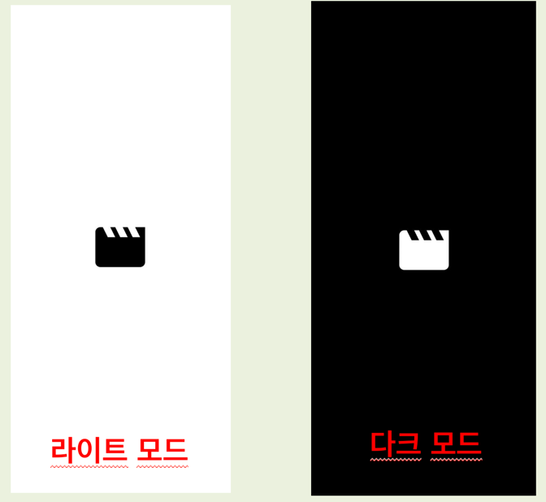
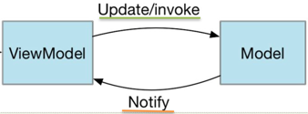
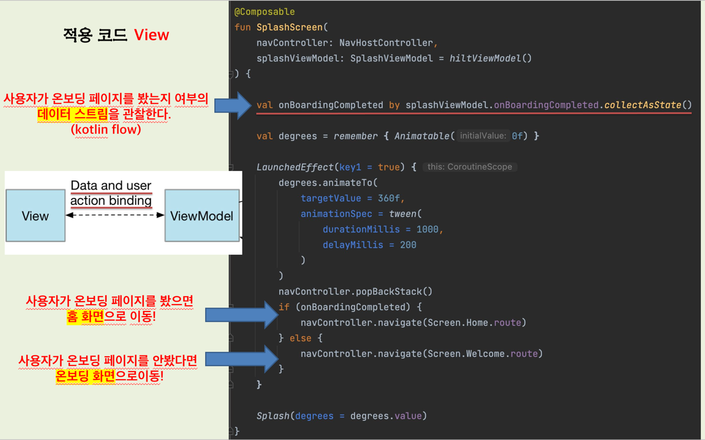
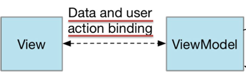
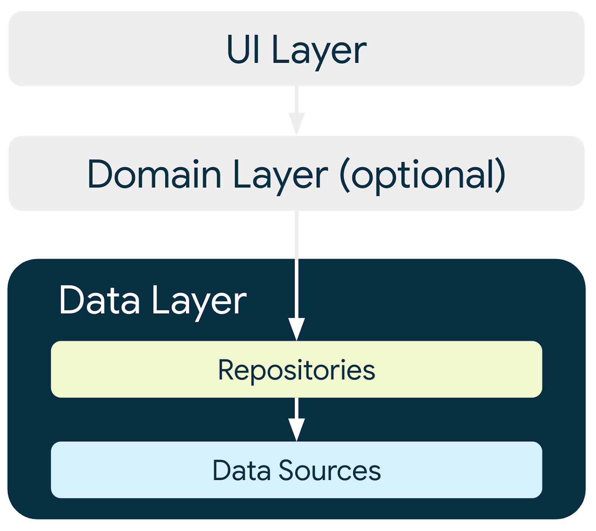
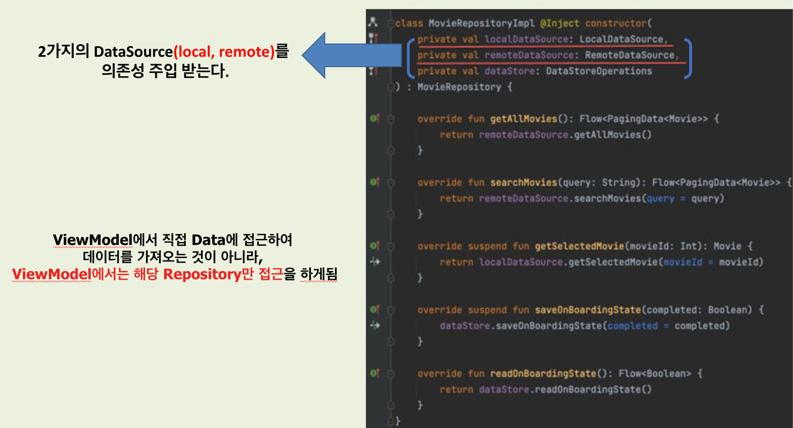
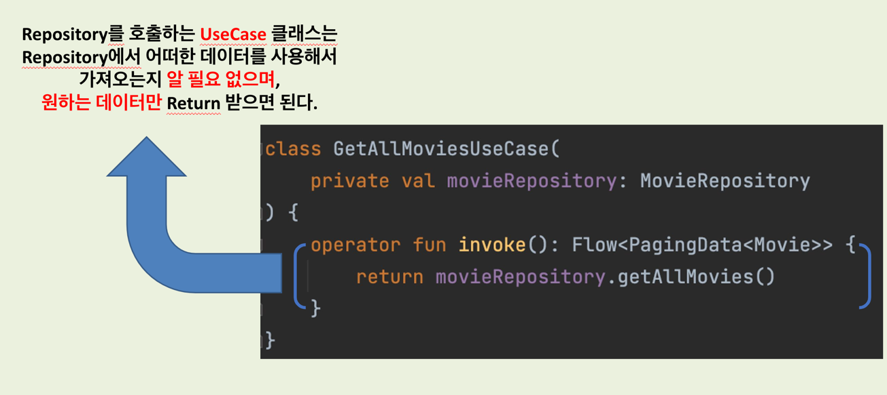
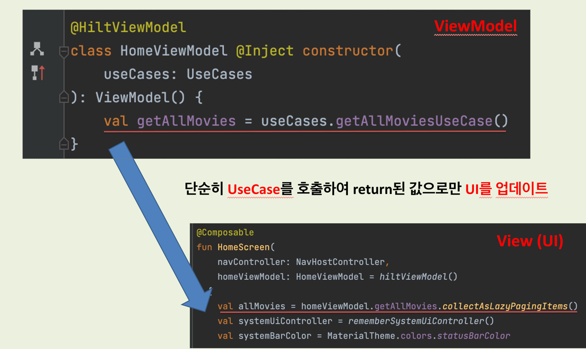

# 소프트웨어 디자인 패턴
해당 문서에서는 오문(오늘의 문화)앱에 적용한 앱 아키텍처에 대해 설명합니다.

## 컨셉 및 목표
- 배포의 목적이 아닌 소프트웨어 아키텍처 및 디자인 패턴의 적용을 고민해보고 공부하기 위한 프로젝트입니다.
- 구글에서 권장하는 [앱 아키텍처 가이드](https://developer.android.com/jetpack/guide) 를 최대한 따르고자 노력합니다.

### 적용한 디자인 패턴
- MVVM (아키텍처 패턴)
- Repository 패턴
- Façade 패턴
- Builder 패턴
- 기타 디자인 패턴은 적용 및 추가 예정

## MVVM (아키텍처 패턴)
**MVVM 패턴을 도입하게 된 이유**

_1. 스플래시_

_2. 온보딩_

_3. 홈_

우선 `1. 스플래시` 화면이 나타나고 나서,

`2. 온보딩`으로 넘어갈지,

`3. 홈`으로 넘어갈지에 대한 로직을 처리해야 했습니다.

사용자가 앱을 최초 실행을 한다면, `2. 온보딩`화면을 보여주고,

사용자가 `2. 온보딩`화면을 한 번이라도 봤다면, 이후에는 

`1. 스플래시` 화면 이후, 곧바로 `3. 홈`화면으로 넘어가도록 구현하고자 하였습니다.

다음은 해당 프로젝트의 `SplashViewModel` 과 `UseCases` 클래스 코드입니다.

<table>
  <tr>
   <td><strong>Name</strong>
   </td>
   <td><strong>Purpose</strong>
   </td>
  </tr>
  <tr>
   <td><code>saveOnBoardingUseCase</code>
   </td>
   <td><code>사용자가 온보딩 화면을 봤는지</code>에 대한 여부를 저장하는 유즈케이스
   </td>
  </tr>
  <tr>
   <td><code>readOnBoardingUseCase</code>
   </td>
   <td><code>사용자가 온보딩 화면을 봤는지</code>에 대한 여부를 읽어오는 유즈케이스
   </td>
  </tr>
  <tr>
   <td><code>onBoardingCompleted</code>
   </td>
   <td><code>사용자가 온보딩 화면을 봤는지</code>에 대한 여부에 대한 <code>State</code>를 가지고 있는 관찰 가능한 <code>StateFlow</code>
   </td>
  </tr>
</table>

`ViewModel`에서 `saveOnBoardingUseCase`를 `invoke`함으로써 `Model`에 `사용자가 온보딩 화면을 봤는지에 대한 여부`를 `update`하게 되며,

`ViewModel`에서 `readOnBoardingUseCase`를 `invoke`함으로써 `Model`로부터 `사용자가 온보딩 화면을 봤는지에 대한 여부`를 `notify`받게 됩니다.

> 참고로, 해당 프로젝트에서는 내부적으로 데이터를 저장하고 읽어오는 로직은 기존의 `SharedPreferences`를 사용하는 방식이 아닌 [DataStore](https://developer.android.com/topic/libraries/architecture/datastore?hl=ko) 로 구현하였습니다.

다음은 해당 프로젝트의 `View`에 해당하는 `SplashScreen` 컴포저블 함수입니다.

이처럼 `View`에서는 `ViewModel`로부터 앞서 언급했던 관찰 가능한 `onBoardingCompleted` `StateFlow`를 관찰하며,
그 결과를 `by` 키워드를 통해 `property delegate`를 한 `onBoardingCompleted`의 `value`에 접근하여
조건문을 통해 `2. 온보딩`화면으로 넘어갈 지, `3. 홈`화면으로 넘어갈지에 대한 로직을 처리할 수 있었습니다.

> 사실, 굳이 `MVVM 패턴`이 아니여도 해당 로직을 포함하여 다른 로직들을 충분히 구현할 수는 있겠지만,
개인적으로 해당 프로젝트에서는 `View`, `ViewModel`, `Model`의 역할과 책임을 분리하고, [관심사 분리(Separation of Concerns)](https://en.wikipedia.org/wiki/Separation_of_concerns) 원칙을 
지키면서 소프트웨어 설계를 하고자 했기 때문에 `MVVM 패턴`을 도입하게 되었습니다.

## Repository 패턴
**Repository 패턴을 적용하게 된 이유**

`Repository 패턴`은 `Data 레이어`를 앱의 나머지 부분 (그림에서는 `UI, Domain 레이어`)과 분리하는 디자인 패턴입니다.
`Data 레이어`는 `UI 레이어`와는 별도로 앱의 데이터와 비즈니스 로직을 처리하는 앱 부분을 나타내며, 
`오문 프로젝트`에서는 `영화 정보 불러오기`, `영화 검색하기` 등의 로직이 그 예시가 될 수 있습니다.

> 하지만, 만약 사용자가 `오문` 앱을 실행하다가, 네트워크 연결이 불안정한 환경에 있게 된다면, 앞서 언급했던 `앱의 핵심 기능들`을 수행할 수 없는
심각한 문제가 예상되었고, 이를 위해서는 네트워크에서 가져온 데이터를 [Room](https://developer.android.com/training/data-storage/room?hl=ko) 을 사용하여 로컬 데이터베이스에 데이터를 저장하여 사용자가 네트워크 연결이 불안정한
상황에 놓여있어도, 로컬 데이터베이스로부터 데이터를 불러옴(캐싱)으로써, 그 문제를 해결해야 하는 과정이 필요했습니다.

> 따라서, 해당 로직을 설계를 전혀 신경쓰지 않고 구현한다면, 코드를 `모듈식`으로, `테스트 가능하게`끔 유지하기가 힘들어질 것이라고 판단하였기 때문에,
`Repository 패턴`을 적용하게 되었습니다.

다음은 해당 프로젝트의 `MovieRepository`를 구현한 `MovieRepositoryImpl` 클래스입니다.

[Hilt](https://developer.android.com/training/dependency-injection/hilt-android?hl=ko) 를 사용하여 해당 클래스에 2가지 종류의 `DataSource`를 주입받게 됩니다.

- LocalDataSource 
- RemoteDataSource

> `LocalDataSource`는 로컬에서 데이터를 받아오는 역할을 하며, `RemoteDataSource`는 서버에서 데이터를 받아오는 역할을 합니다.

영화 정보를 불러오는 역할을 하는 `GetAllMoviesUseCase`에서는 앞서 언급한 `MovieRepository`로부터 
어떠한 `DataSource`를 통해 데이터를 가져오는지 알 수 없습니다.

`ViewModel`에 주입된 `UseCases` 데이터 클래스에는 `오문 앱`의 여러 도메인 로직들을 처리하기 위한 유즈케이스들이 정의가 되어있는데,
`3. 홈`화면에 대한 `HomeViewModel` 클래스에서는 단순히 `GetAllMoviesUseCase`를 호출하여, 관찰 가능한 `Flow<PagingData<Movie>>`
타입의 `getAllMovies`를 저장하고, 이를 `View` 역할을 담당하는 `HomeScreen` 컴포저블 함수에서 `collectAsLazyPagingItem()` 메서드를 통해 앞서 발행된
데이터를 소비하며 이를 `UI` 컴포넌트에 반영하게 됩니다.

> 이렇게 `Repository 패턴`의 적용을 통해 `Data 레이어`를 캡슐화 할 수 있게 되었고, `ViewModel`이 포함되어 있는
> `UI 레이어`에서 `Data 레이어`에 직접 접근하지 않고, `Repository` 클래스를 통해서만 로직을 처리하는 일관된 인터페이스를 갖고 있기 때문에, 클래스 간의 결합도를 감소시킬 수 있었다는 장점이 있었습니다.
> 또한 해당 프로젝트에서는 아직 `단위 테스트` 코드를 작성하지 않았지만, 향후 테스트 코드를 작성할 때에도 유리한 소프트웨어를 설계할 수 있었습니다.