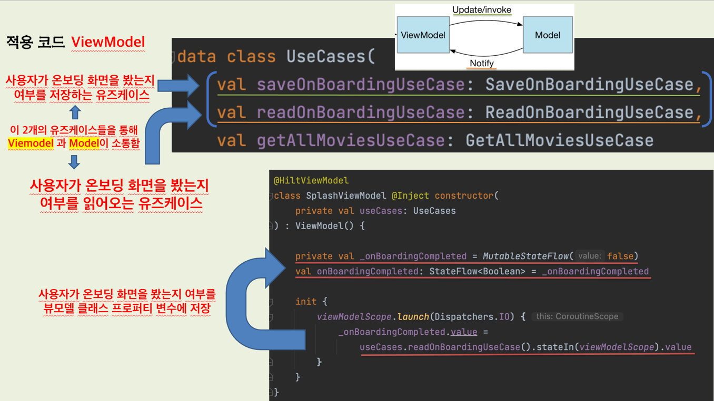

# 소프트웨어 디자인 패턴
해당 문서에서는 오문(오늘의 문화)앱에 적용한 앱 아키텍처에 대해 설명합니다.

## 컨셉 및 목표
- 배포의 목적이 아닌 소프트웨어 아키텍처 및 디자인 패턴의 적용을 고민해보고 공부하기 위한 프로젝트입니다.
- 구글에서 권장하는 [앱 아키텍처 가이드](https://developer.android.com/jetpack/guide) 를 최대한 따르고자 노력합니다.

### 적용한 디자인 패턴
- MVVM (아키텍처 패턴)
- Repository 패턴
- Façade 패턴
- Builder 패턴
- 기타 디자인 패턴은 적용 및 추가 예정

## MVVM (아키텍처 패턴)
**MVVM 패턴을 도입하게 된 이유**

_1. 스플래시_

_2. 온보딩_

_3. 홈_

우선 `1. 스플래시` 화면이 나타나고 나서,

`2. 온보딩`으로 넘어갈지,

`3. 홈`으로 넘어갈지에 대한 로직을 처리해야 했습니다.

사용자가 앱을 최초 실행을 한다면, `2. 온보딩`화면을 보여주고,

사용자가 `2. 온보딩`화면을 한 번이라도 봤다면, 이후에는 

`1. 스플래시` 화면 이후, 곧바로 `3. 홈`화면으로 넘어가도록 구현하고자 하였습니다.

다음은 해당 프로젝트의 `SplashViewModel` 과 `UseCases` 클래스 코드입니다.

<table>
  <tr>
   <td><strong>Name</strong>
   </td>
   <td><strong>Purpose</strong>
   </td>
  </tr>
  <tr>
   <td><code>saveOnBoardingUseCase</code>
   </td>
   <td><code>사용자가 온보딩 화면을 봤는지</code>에 대한 여부를 저장하는 유즈케이스
   </td>
  </tr>
  <tr>
   <td><code>readOnBoardingUseCase</code>
   </td>
   <td><code>사용자가 온보딩 화면을 봤는지</code>에 대한 여부를 읽어오는 유즈케이스
   </td>
  </tr>
  <tr>
   <td><code>onBoardingCompleted</code>
   </td>
   <td><code>사용자가 온보딩 화면을 봤는지</code>에 대한 여부에 대한 <code>State</code>를 가지고 있는 관찰 가능한 <code>StateFlow</code>
   </td>
  </tr>
</table>

`ViewModel`에서 `saveOnBoardingUseCase`를 `invoke`함으로써 `Model`에 `사용자가 온보딩 화면을 봤는지에 대한 여부`를 `update`하게 되며,

`ViewModel`에서 `readOnBoardingUseCase`를 `invoke`함으로써 `Model`로부터 `사용자가 온보딩 화면을 봤는지에 대한 여부`를 `notify`받게 됩니다.

참고로, 해당 프로젝트에서는 내부적으로 데이터를 저장하고 읽어오는 로직은 기존의 `SharedPreferences`를 사용하는 방식이 아닌 [DataStore](https://developer.android.com/topic/libraries/architecture/datastore?hl=ko) 로 구현하였습니다.

다음은 해당 프로젝트의 `View`에 해당하는 `SplashScreen` 컴포저블 함수입니다.

이처럼 `View`에서는 `ViewModel`로부터 앞서 언급했던 관찰 가능한 `onBoardingCompleted` `StateFlow`를 관찰하며,
그 결과를 `by` 키워드를 통해 `property delegate`를 한 `onBoardingCompleted`의 `value`에 접근하여
조건문을 통해 `2. 온보딩`화면으로 넘어갈 지, `3. 홈`화면으로 넘어갈지에 대한 로직을 처리할 수 있었습니다.

사실, 굳이 `MVVM 패턴`이 아니여도 해당 로직을 포함하여 다른 로직들을 충분히 구현할 수는 있겠지만,
개인적으로 해당 프로젝트에서는 `View`, `ViewModel`, `Model`의 역할과 책임을 분리하고, [관심사 분리(Separation of Concerns)](https://en.wikipedia.org/wiki/Separation_of_concerns) 원칙을 
지키면서 소프트웨어 설계를 하고자 했기 때문에 `MVVM 패턴`을 도입하게 되었습니다.

